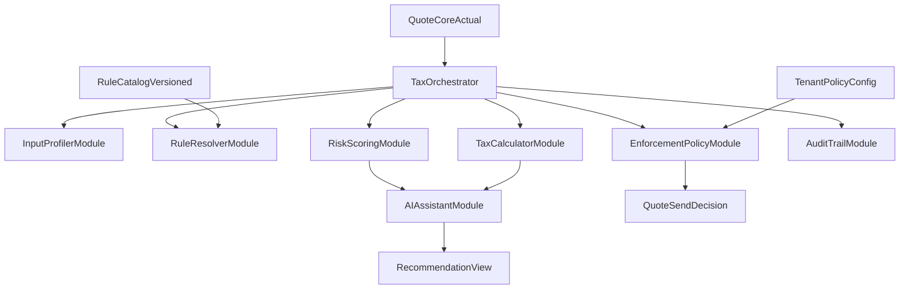

# Plan prioritario unificado: Modulo fiscal transfronterizo + IA

## Parte A - Vision ejecutiva (1 pagina)

## Problema de negocio

Las empresas que venden entre LATAM y USA suelen cotizar con buen margen operativo, pero con baja visibilidad de impacto fiscal real (retenciones, impuestos indirectos, FX, riesgo documental). Esto genera ceguera de rentabilidad neta y riesgos de cumplimiento.

## Objetivo ejecutivo

Agregar un modulo complementario al cotizador actual para:

- Reducir riesgo fiscal transfronterizo en propuestas.
- Calcular margen neto post-impuestos.
- Mantener baja friccion para freelancers/PyMEs.
- Ofrecer gobierno fuerte para enterprise.

## Estrategia de producto

Implementacion por madurez de cuenta:

- `lite`: guiar, no bloquear.
- `growth`: alertar y bloquear solo riesgos altos.
- `enterprise`: control estricto + aprobacion fiscal/legal.

## Diferencial con IA

La IA no reemplaza reglas tributarias; las potencia:

- Explica riesgos en lenguaje de negocio.
- Sugiere datos faltantes y acciones correctivas.
- Prioriza alertas y simula escenarios de margen neto.

## KPI objetivo

- Menor porcentaje de propuestas en riesgo alto enviadas sin correccion.
- Mayor precision de margen neto estimado por pais.
- Mayor completitud de datos fiscales por segmento.

---

## Parte B - Plan tecnico detallado

## 1) Arquitectura modular de reglas principales

## 2) Modulos funcionales (core)

### `InputProfilerModule`

- Define campos obligatorios por `mode` (`lite/growth/enterprise`).
- Activa progressive profiling segun riesgo y tipo de operacion.

### `RuleResolverModule`

- Determina reglas aplicables por:
  - pais proveedor
  - pais cliente
  - tipo de servicio
  - B2B/B2C
  - moneda y contexto transfronterizo
- Usa catalogo versionado por jurisdiccion.

### `TaxCalculatorModule`

- Calcula:
  - impuestos indirectos estimados
  - retenciones estimadas
  - neto esperado
  - margen neto post-impuestos

### `RiskScoringModule`

- Evalua riesgo `low/medium/high`.
- Emite razones trazables por regla.

### `EnforcementPolicyModule`

- Aplica politica por tenant:
  - `soft`: advierte y permite.
  - `hard`: bloquea envio en condiciones definidas.

### `AuditTrailModule`

- Registra:
  - reglas aplicadas (version)
  - score de riesgo
  - decisiones de bloqueo/override
  - recomendaciones IA aceptadas/rechazadas

## 3) Catalogo de reglas principales (MVP)

Para COL/MEX/USA incluir reglas base:

1. `crossborderOperationRule`
   - Detecta si operacion es domestica o transfronteriza.
2. `serviceTypeClassificationRule`
   - Clasifica naturaleza fiscal del servicio.
3. `indirectTaxApplicabilityRule`
   - Determina si aplica impuesto indirecto estimado.
4. `withholdingApplicabilityRule`
   - Determina retencion estimada en origen/destino.
5. `fxExposureRule`
   - Calcula exposicion por moneda y sensibilidad basica.
6. `dataCompletenessRule`
   - Mide completitud fiscal minima por modo.
7. `documentationRequirementRule`
   - Marca evidencias minimas requeridas (growth/enterprise).

## 4) Capa de IA complementaria (sin romper compliance)

### `AIAssistantModule`

- `explainRisk`: explica causas de riesgo en lenguaje de negocio.
- `suggestNextBestAction`: sugiere accion para reducir riesgo.
- `suggestMissingData`: sugiere campos faltantes de mayor impacto.
- `simulateScenario` (growth/enterprise): estima impacto en margen neto.

### Guardrails obligatorios

- IA no aprueba ni desbloquea envios.
- Toda recomendacion incluye:
  - razones
  - datos usados
  - confianza
- Bloqueo final solo por regla + politica tenant.

## 5) Matriz por nivel de cliente

- **Lite**
  - Campos minimos, semaforo y explicacion simple.
  - Sin bloqueo por defecto.
- **Growth**
  - Campos adicionales, margen neto y checklist.
  - Bloqueo en riesgo alto (configurable).
- **Enterprise**
  - Campos avanzados + aprobacion fiscal/legal.
  - Bloqueo duro y auditoria completa.

## 6) Fases de implementacion

- **Fase 0 (1 sprint): diseno**
  - Matriz de campos por modo.
  - Taxonomia de reglas y contrato de salida.
  - Politicas de enforcement.
- **Fase 1 (1-2 sprints): MVP Lite**
  - RuleCatalog + TaxCalculator + RiskScoring basico.
  - UI de semaforo y explicacion IA basica.
- **Fase 2 (2 sprints): Growth**
  - Completitud avanzada, margen neto robusto, bloqueos condicionales.
  - IA de priorizacion y recomendaciones.
- **Fase 3 (2-3 sprints): Enterprise**
  - Workflow de aprobacion, auditoria extendida.
  - IA de simulacion y control documental.

## 7) Cambios tecnicos propuestos (cuando se ejecute)

- Backend
  - Extender [backend/app/schemas/quote.py](../../../../backend/app/schemas/quote.py) con salida fiscal complementaria.
  - Nuevos servicios en [backend/app/services](../../../../backend/app/services):
    - `tax_rule_service`
    - `tax_calculation_service`
    - `crossborder_risk_service`
    - `tax_enforcement_service`
    - `tax_ai_assistant_service`
  - Endpoints de evaluacion fiscal en [backend/app/api/v1/endpoints](../../../../backend/app/api/v1/endpoints).
  - Configuracion por tenant en [backend/app/models/organization.py](../../../../backend/app/models/organization.py) y [backend/app/schemas/organization.py](../../../../backend/app/schemas/organization.py).
- Frontend
  - Integrar capa fiscal en [nougram_front/src/context/QuoteBuilderContext.tsx](../../../../nougram_front/src/context/QuoteBuilderContext.tsx).
  - UI de riesgo + recomendaciones IA en resumen de cotizacion.
  - UX adaptativa por modo tenant.
- Datos y gobierno
  - Catalogo versionado de reglas.
  - Audit logs de decisiones y overrides.

## 8) Definicion de bloqueo

- `low`: nunca bloquea.
- `medium`: bloquea solo en enterprise/hard.
- `high`: bloquea en growth y enterprise (override con justificacion y auditoria).

## 9) Entregables

- Matriz de campos por nivel.
- Catalogo de reglas principales COL/MEX/USA (MVP).
- Especificacion API + contratos frontend.
- Checklist QA por modo y tipo de operacion.
- Guia de guardrails IA y monitoreo de calidad.

